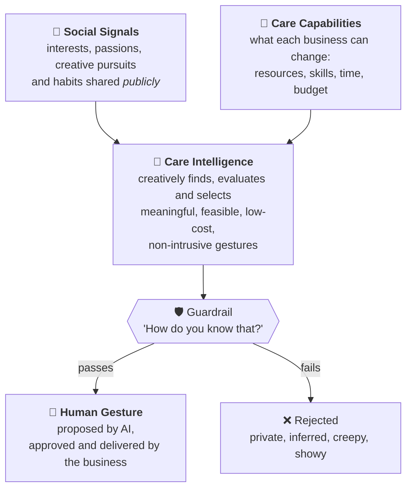

# SEENDO

**Small gestures, real recognition.**

Some services just deliver. Some add a little extra. The best ones make it personal.
SEENDO is an agent that reads only what a customer has made **public**, matches it with what a business can **really do**, and suggests **tiny, almost free** touches that a human then approves and delivers.

> *"They saw me as a person, not just a customer."*

[](https://youtu.be/_OBFE8PEDPI)

**▶ Demo video (60 s): https://youtu.be/_OBFE8PEDPI**

**▶ Live demo: https://knapejar.github.io/seendo/** (mock: replays the recorded runs of all five examples step by step, no LLM calls, works instantly)

Agents 0.0.7 · From Dusk Till Dawn Hackathon #01 · topic **Social Media Deep Research** (research goal: hospitality; a person and a journey go in, a report with traceable sources comes out).

## The process



| Step | What happens | Output |
|---|---|---|
| **1. Social Signals** | Public profile notes are split into signals. Each gets a **source**, a **confidence**, and a verdict: usable ✅, conditional ⚠️, or never ❌. Owner-only data (phone, e-mail, birthday, address) and relationships inferred from *other people's* accounts are discarded even when the agent can see them. | signal table + one-line persona |
| **2. Care Capabilities** | Each business on the journey describes what it can change (seat, card, story, tasting) and its limits (price, route, budget of a few euros). | capability table |
| **3. Care Intelligence** | Claude matches signals with capabilities and proposes 3–6 concrete touches per business, each traceable to the signal behind it, with cost and visibility: 🟢 silent (guest won't notice it was targeted), 🟡 subtle (looks like attentive staff), 🔵 explicit (opt-in only). | gestures per business |
| **4. Guardrail** | Every idea runs through the **"How do you know that?"** test. Creepy, private or showy ideas are rejected **with the reason**, and the rejections are part of the report. | rejected list |
| **5. Human Gesture** | The business sees *why* each touch was proposed; the guest only sees care. A human approves and delivers. | |

### Rules the agent never breaks

1. Public sources only. Anything the source marks as private is dropped.
2. The product stays the same, only attention changes. No touch costs more than a few euros.
3. Most touches are silent. If a guess misses, nothing bad happens.
4. Explicit mentions ("we saw your post") only with opt-in.
5. Every touch has a trail: signal → source → cost → visibility.

## Five end-to-end examples

| # | Person | Journey | Highlights | Full output |
|---|---|---|---|---|
| 1 | **Jarda** (real, a team member, his own public profiles): developer, mountain lover, cipher-game fan | Train Prague → Kraków, hotel, tour, lunch | coffee with a cipher whose answer is a local tip · handwritten note "sunrise at Kościuszko Mound, you can see the Tatras" · the Wawel dragon told as *Kraków's first hack* · a free taste of oscypek from the same mountains · ❌ German shepherd bedsheets | [examples/01-krakow](examples/01-krakow/output.md) |
| 2 | **Marta** (fictional): paediatric nurse, runner, film photographer, learning Portuguese | Flight Prague → Lisbon, guesthouse, surf lesson, café | morning-light window seat · map of an early riverside running loop · sunrise viewpoints on the welcome card · barista answers kindly in Portuguese only if she starts in Portuguese · ❌ a roll of Portra 400 film in the room, ❌ "congrats on your half marathon", ❌ anything built on an inferred breakup | [examples/02-lisbon](examples/02-lisbon/output.md) |
| 3 | **Tomáš** (fictional): new dad, board-game designer, balcony birdwatcher | A Saturday of errands in Brno: car service, optician, bakery | window seat by a bird feeder in the car-service waiting room · bird-print lens cloth · weekly logic riddle in the bakery bag · ❌ hedgehog-shaped roll (points straight at his game), ❌ baby congratulations from a social post, ❌ anything about his wife's health | [examples/03-errands](examples/03-errands/output.md) |
| 4 | **Ama** (fictional): timber structural engineer from Rotterdam, 43 houseplants, Dutch city bike | Moving into a 4th-floor walk-up in Vienna: movers, fibre technician, locksmith, Brunnenmarkt stall | crew keeps the window walls free and the heated flat closed before her plants arrive · first-week checklist with the 3-day Meldezettel deadline ticked · bike goes straight to the courtyard bike room (house rule) · ❌ "congrats on the new job", ❌ fear-selling security after a deleted burglary post, ❌ plant touches stacked at every stop | [examples/04-vienna-move](examples/04-vienna-move/output.md) |
| 5 | **Margit, 72** (fictional): widowed retired music teacher, crossword solver, old-tram nostalgia | A Wednesday in Budapest: library, pharmacy, a new hairdresser, Lukács Bath | pharmacy note for everyone: Friday 23 Oct is a holiday, here is the on-duty pharmacy · prescription end date on the label · one Füles crossword at the salon, and only one personal touch · ❌ condolences two days after the anniversary, ❌ sugar-free pastry from her diabetes-group posts, ❌ knitting small talk (that's a namesake in Debrecen) | [examples/05-budapest-wednesday](examples/05-budapest-wednesday/output.md) |

Examples 3–5 show the same pipeline works outside travel: any service with a human touchpoint. Cases 4 and 5 were designed to be hard: their profiles hide unlabelled traps (immigration and religion data, a deleted post kept by the Wayback Machine, a pseudonymous Reddit account linked only by a photo, a namesake's Instagram, a friends-only post screenshotted into a public group, grief, health, jokes that look like facts). A creator agent wrote them and a critic agent reviewed them over three rounds against copying cases 1–3, factual errors and missed traps.

### Example 1 at a glance (the demo video)

| Business | Signal (public source) | Gesture | Cost |
|---|---|---|---|
| 🚆 Train | cipher games (Facebook) | coffee comes with a cipher card, the answer is "Plac Nowy, zapiekanka after midnight" | €0.10 |
| 🏨 Hotel | mountain photos (Instagram) | handwritten note: sunrise at Kościuszko Mound, on clear mornings you can see the Tatras | €0.20 |
| 🗺️ Tour | developer (LinkedIn) | the Wawel dragon legend as Kraków's first hack, plus how its gas burner works | €0 |
| 🍽️ Lunch | mountain photos (Instagram) | a free taste of oscypek, smoked cheese from those same mountains | €2 |
| ❌ Rejected | German shepherd (Instagram) | German shepherd bedsheets: too intimate, too showy. Caring, not creepy. | |

## Run it

Requires Python 3.10+ and the [Claude Code CLI](https://docs.claude.com/en/docs/claude-code) logged in (a Claude subscription is enough, no API key). No other dependencies.

```bash
python seendo.py examples/02-lisbon      # writes examples/02-lisbon/output.md and output.json
```

New case: create `my-case/input/profile.md` (public profile notes with sources) and `my-case/input/journey.md` (businesses, what they can change, their limits), then `python seendo.py my-case`.

All logic is in [`seendo.py`](seendo.py) (~120 lines): two Claude calls (Social Signals, Care Intelligence + guardrail) and a Markdown renderer.

## Honest status: what is real, simulated, missing

| | |
|---|---|
| ✅ **Real** | The pipeline in `seendo.py` runs end to end on Claude Code. Examples 2–5 are its unedited output (2–3 from the first prompt version; the critic loop then fixed a Step-1 prompt bias before 4–5). Example 1 was produced with Claude Code following the same steps and prompts during the night; the video is built on it. Example 1's profile is real public data of a team member, collected with his consent, with contacts removed. |
| 🟡 **Simulated** | The live demo page is a mock: it replays recorded outputs from `examples/` and makes no LLM calls. Profile collection: public profiles were read and summarised into `profile.md` by hand / with a browser agent, not by a scraper in this repo. Business capabilities are written by hand. Personas in examples 2–5 are fictional. |
| ❌ **Missing** | Automated scraping (e.g. Apify actors for Instagram/LinkedIn) · a business-side approval UI · the guest opt-in flow for explicit touches · delivery integrations (POS, hotel PMS) · evaluation on more than five cases. |

The guardrail is an LLM judgement, not a guarantee: a human at the business approves every gesture before it reaches the guest. That is a deliberate part of the design.

## Why

Personalisation online is usually used to sell more. SEENDO uses the same signals to **care** more, in the physical world, for almost no money, and draws a hard line between *recognition* and *surveillance*.
